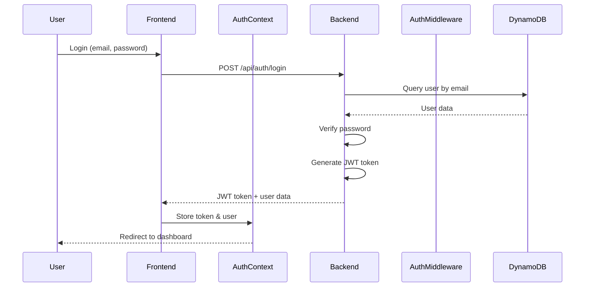
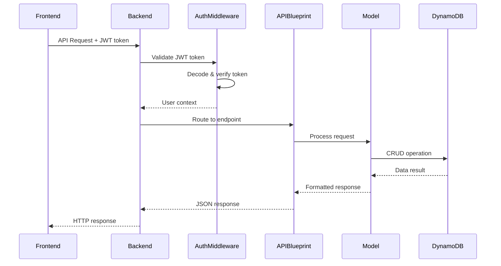
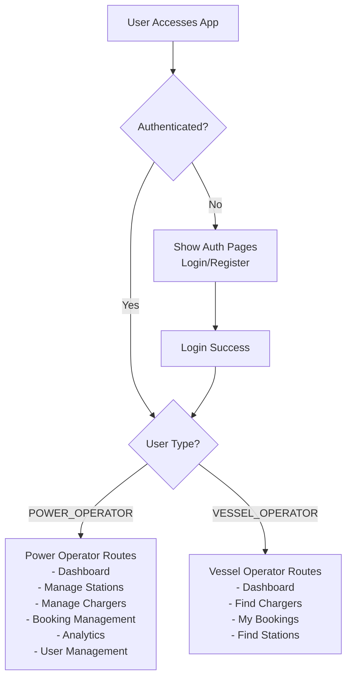
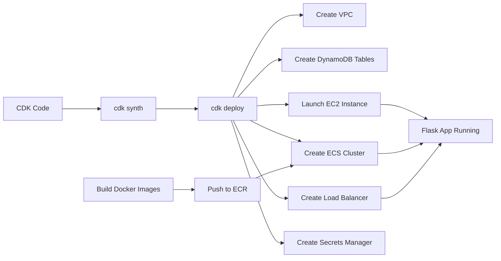

# AquaCharge System Architecture Diagram

This document provides a visual representation of how the components of the AquaCharge repository interact.

## System Overview

```mermaid
graph TB
    subgraph "Client Layer"
        Browser[Web Browser]
    end

    subgraph "Frontend Layer - React Application"
        direction TB
        App[App.jsx<br/>Router & Auth Provider]
        AuthContext[AuthContext<br/>Authentication State]
        
        subgraph "Route Handlers"
            VORoutes[VesselOperatorRoutes<br/>VESSEL_OPERATOR views]
            PORoutes[PowerOperatorRoutes<br/>POWER_OPERATOR views]
        end
        
        subgraph "Pages"
            VOPages[Vessel Pages<br/>- Dashboard<br/>- FindChargers<br/>- MyBookings<br/>- FindStations]
            POPages[Power Pages<br/>- Dashboard<br/>- ManageStations<br/>- ManageChargers<br/>- BookingManagement<br/>- Analytics<br/>- UserManagement]
            AuthPages[Auth Pages<br/>- Login<br/>- Register<br/>- ForgotPassword]
        end
        
        subgraph "Components"
            SharedComp[Shared Components<br/>- MapView<br/>- UI Components<br/>- UserTypeIndicator]
            StationComp[Station Components<br/>- StationDetailsCard<br/>- StationSearchFilters]
        end
        
        APIConfig[API Config<br/>api.js]
    end

    subgraph "API Communication Layer"
        HTTP[HTTP/HTTPS Requests<br/>REST API Calls]
        JWT[JWT Tokens<br/>Bearer Authentication]
    end

    subgraph "Backend Layer - Flask Application"
        direction TB
        FlaskApp[Flask App<br/>app.py<br/>CORS, Rate Limiting]
        
        subgraph "API Blueprints"
            AuthBP[Auth Blueprint<br/>/api/auth<br/>- login<br/>- register<br/>- verify-token<br/>- refresh<br/>- forgot-password]
            UsersBP[Users Blueprint<br/>/api/users]
            StationsBP[Stations Blueprint<br/>/api/stations]
            ChargersBP[Chargers Blueprint<br/>/api/chargers]
            VesselsBP[Vessels Blueprint<br/>/api/vessels]
            BookingsBP[Bookings Blueprint<br/>/api/bookings]
            ContractsBP[Contracts Blueprint<br/>/api/contracts]
            PortsBP[Ports Blueprint<br/>/api/ports]
        end
        
        subgraph "Middleware"
            AuthMiddleware[Auth Middleware<br/>- require_auth<br/>- require_role<br/>- JWT validation]
        end
        
        subgraph "Models"
            UserModel[User Model]
            StationModel[Station Model]
            ChargerModel[Charger Model]
            VesselModel[Vessel Model]
            BookingModel[Booking Model]
            ContractModel[Contract Model]
        end
        
        subgraph "Services"
            PortService[Ports Service<br/>Repository Pattern]
        end
    end

    subgraph "Data Layer"
        direction TB
        DynamoClient[DynamoDB Client<br/>dynamoClient.py<br/>CRUD Operations]
        
        subgraph "DynamoDB Tables"
            UsersTable[(Users Table<br/>PK: id<br/>GSI: email-index, orgId-index)]
            StationsTable[(Stations Table<br/>PK: id<br/>GSI: city-index, status-index)]
            ChargersTable[(Chargers Table<br/>PK: id<br/>GSI: chargingStationId-index, chargerType-index)]
            VesselsTable[(Vessels Table<br/>PK: id<br/>GSI: userId-index, vesselType-index)]
            BookingsTable[(Bookings Table<br/>PK: id<br/>GSI: userId-index, stationId-index, vesselId-index, status-index)]
            ContractsTable[(Contracts Table)]
        end
    end

    subgraph "Infrastructure Layer - AWS"
        direction TB
        CDK[AWS CDK<br/>Infrastructure as Code]
        
        subgraph "Compute"
            EC2[EC2 Instance<br/>Application Host]
            ECS[ECS Fargate<br/>Containerized Services]
        end
        
        subgraph "Networking"
            VPC[VPC<br/>Public/Private Subnets]
            ALB[Application Load Balancer]
            SecurityGroups[Security Groups]
        end
        
        subgraph "Storage & Services"
            ECR[ECR<br/>Container Registry]
            SecretsManager[Secrets Manager<br/>JWT Secrets]
            CloudWatch[CloudWatch Logs<br/>Monitoring & Logging]
        end
    end

    subgraph "External Services"
        AWSClient[AWS SDK<br/>boto3]
        EmailService[Email Service<br/>Password Reset]
    end

    %% Client to Frontend
    Browser --> App
    
    %% Frontend Internal Flow
    App --> AuthContext
    App --> VORoutes
    App --> PORoutes
    App --> AuthPages
    VORoutes --> VOPages
    PORoutes --> POPages
    VOPages --> SharedComp
    POPages --> SharedComp
    VOPages --> StationComp
    POPages --> StationComp
    AuthContext --> APIConfig
    VOPages --> APIConfig
    POPages --> APIConfig
    
    %% Frontend to API
    APIConfig --> HTTP
    AuthContext --> JWT
    
    %% API to Backend
    HTTP --> FlaskApp
    JWT --> AuthMiddleware
    
    %% Backend Internal Flow
    FlaskApp --> AuthBP
    FlaskApp --> UsersBP
    FlaskApp --> StationsBP
    FlaskApp --> ChargersBP
    FlaskApp --> VesselsBP
    FlaskApp --> BookingsBP
    FlaskApp --> ContractsBP
    FlaskApp --> PortsBP
    
    AuthBP --> AuthMiddleware
    UsersBP --> AuthMiddleware
    StationsBP --> AuthMiddleware
    ChargersBP --> AuthMiddleware
    VesselsBP --> AuthMiddleware
    BookingsBP --> AuthMiddleware
    ContractsBP --> AuthMiddleware
    PortsBP --> AuthMiddleware
    
    UsersBP --> UserModel
    StationsBP --> StationModel
    ChargersBP --> ChargerModel
    VesselsBP --> VesselModel
    BookingsBP --> BookingModel
    ContractsBP --> ContractModel
    PortsBP --> PortService
    
    %% Backend to Data Layer
    UserModel --> DynamoClient
    StationModel --> DynamoClient
    ChargerModel --> DynamoClient
    VesselModel --> DynamoClient
    BookingModel --> DynamoClient
    ContractModel --> DynamoClient
    PortService --> DynamoClient
    
    DynamoClient --> UsersTable
    DynamoClient --> StationsTable
    DynamoClient --> ChargersTable
    DynamoClient --> VesselsTable
    DynamoClient --> BookingsTable
    DynamoClient --> ContractsTable
    
    %% Infrastructure
    CDK --> VPC
    CDK --> EC2
    CDK --> ECS
    CDK --> ALB
    CDK --> SecurityGroups
    CDK --> ECR
    CDK --> SecretsManager
    CDK --> CloudWatch
    CDK --> UsersTable
    CDK --> StationsTable
    CDK --> ChargersTable
    CDK --> VesselsTable
    CDK --> BookingsTable
    CDK --> ContractsTable
    
    ALB --> EC2
    ALB --> ECS
    EC2 --> FlaskApp
    ECS --> FlaskApp
    
    %% External Services
    DynamoClient --> AWSClient
    AuthBP --> EmailService
    FlaskApp --> SecretsManager
    FlaskApp --> CloudWatch
    
    %% Styling
    classDef frontend fill:#e1f5ff,stroke:#01579b,stroke-width:2px
    classDef backend fill:#fff3e0,stroke:#e65100,stroke-width:2px
    classDef database fill:#f3e5f5,stroke:#4a148c,stroke-width:2px
    classDef infrastructure fill:#e8f5e9,stroke:#1b5e20,stroke-width:2px
    classDef external fill:#fce4ec,stroke:#880e4f,stroke-width:2px
    
    class App,AuthContext,VORoutes,PORoutes,VOPages,POPages,AuthPages,SharedComp,StationComp,APIConfig frontend
    class FlaskApp,AuthBP,UsersBP,StationsBP,ChargersBP,VesselsBP,BookingsBP,ContractsBP,PortsBP,AuthMiddleware,UserModel,StationModel,ChargerModel,VesselModel,BookingModel,ContractModel,PortService backend
    class DynamoClient,UsersTable,StationsTable,ChargersTable,VesselsTable,BookingsTable,ContractsTable database
    class CDK,EC2,ECS,VPC,ALB,SecurityGroups,ECR,SecretsManager,CloudWatch infrastructure
    class AWSClient,EmailService external
```

## Component Interaction Flows

### 1. Authentication Flow

### 2. API Request Flow (Authenticated)

### 3. User Type Routing Flow

### 4. Infrastructure Deployment Flow

## Key Components Description

### Frontend Components
- **App.jsx**: Main application router that determines user routing based on authentication and user type
- **AuthContext**: Manages authentication state, JWT tokens, and user data
- **Route Handlers**: Separate route configurations for Vessel Operators and Power Operators
- **Pages**: User type-specific pages with different functionality
- **Shared Components**: Reusable UI components and business logic components

### Backend Components
- **Flask App**: Main application with CORS, rate limiting, and blueprint registration
- **API Blueprints**: Modular route handlers for different resources (auth, users, stations, etc.)
- **Middleware**: Authentication and authorization middleware using JWT
- **Models**: Data models that interact with DynamoDB
- **Services**: Business logic layer (e.g., Ports service with repository pattern)

### Data Layer
- **DynamoDB Client**: Abstraction layer for DynamoDB operations (CRUD, queries, GSI queries)
- **DynamoDB Tables**: NoSQL tables with partition keys and global secondary indexes for efficient querying

### Infrastructure
- **AWS CDK**: Infrastructure as Code for provisioning AWS resources
- **EC2/ECS**: Compute resources for running the application
- **VPC & Networking**: Network isolation and load balancing
- **Secrets Manager**: Secure storage for JWT secrets and credentials
- **CloudWatch**: Logging and monitoring

## Data Flow Summary

1. **User Request** → Browser → React App
2. **Authentication** → AuthContext → Backend Auth API → DynamoDB Users Table
3. **API Requests** → Frontend → Flask App → Auth Middleware → API Blueprint → Model → DynamoDB
4. **Response** → DynamoDB → Model → API Blueprint → Flask App → Frontend → Browser
5. **Infrastructure** → CDK deploys → AWS Resources → Application runs on EC2/ECS

## Technology Stack

- **Frontend**: React 18, Vite, React Router, Tailwind CSS
- **Backend**: Python 3.11, Flask 3.0, Flask-CORS, Flask-Limiter
- **Database**: AWS DynamoDB (NoSQL)
- **Infrastructure**: AWS CDK (TypeScript), EC2, ECS Fargate, VPC, ALB
- **Authentication**: JWT (HS256)
- **Deployment**: Docker, ECR, ECS
