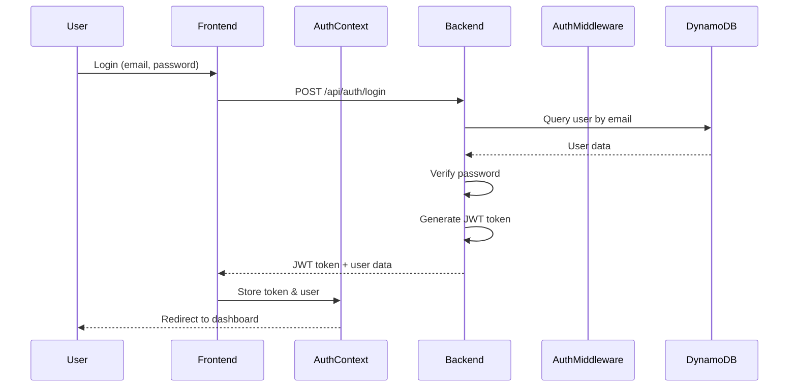
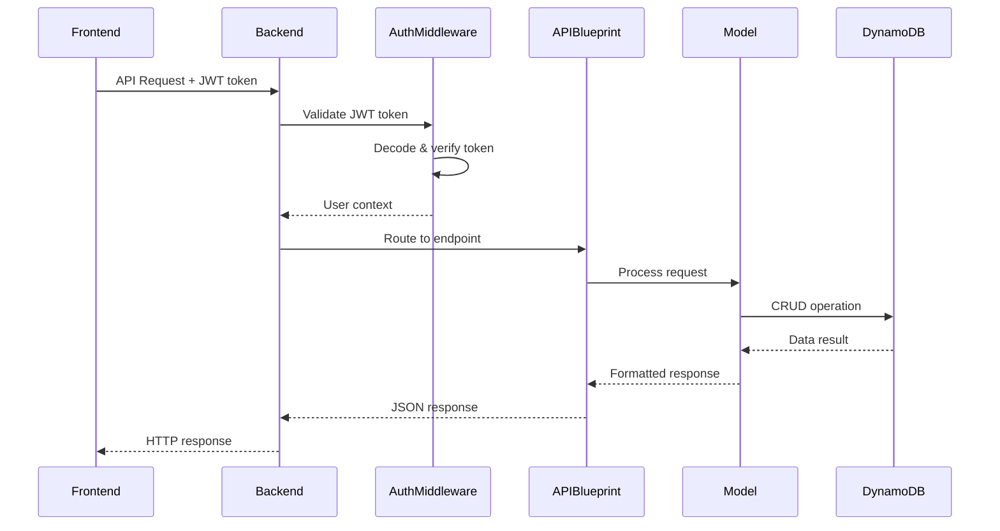
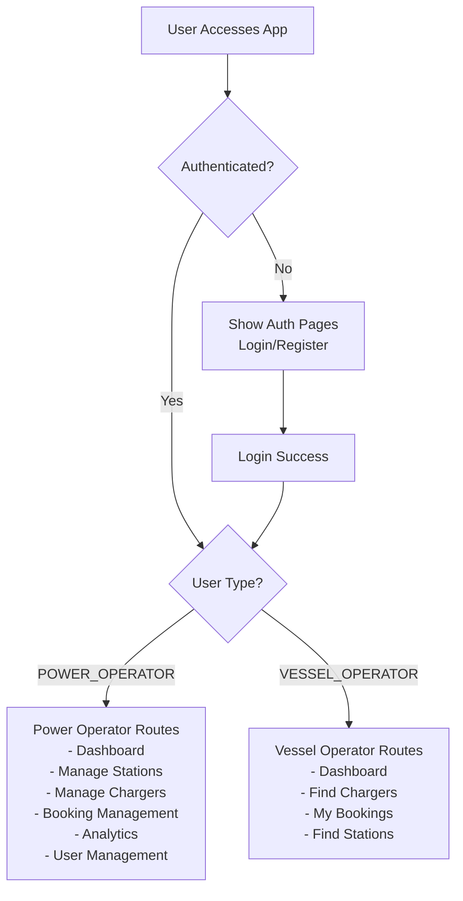
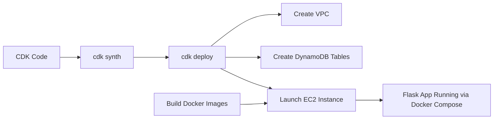

# AquaCharge System Architecture Diagram

This document provides a visual representation of how the components of the AquaCharge repository interact.

## System Overview

```mermaid
graph TB
    subgraph "Client Layer"
        Browser[Web Browser]
    end

    subgraph "Frontend Layer - React Application"
        direction TB
        App[App.jsx<br/>Router & Auth Provider]
        AuthContext[AuthContext<br/>Authentication State]

        subgraph "Route Handlers"
            VORoutes[VesselOperatorRoutes<br/>VESSEL_OPERATOR views]
            PORoutes[PowerOperatorRoutes<br/>POWER_OPERATOR views]
        end

        subgraph "Pages"
            VOPages[Vessel Pages<br/>- Dashboard<br/>- FindChargers<br/>- MyBookings<br/>- FindStations]
            POPages[Power Pages<br/>- Dashboard<br/>- ManageStations<br/>- ManageChargers<br/>- BookingManagement<br/>- Analytics<br/>- UserManagement]
            AuthPages[Auth Pages<br/>- Login<br/>- Register<br/>- ForgotPassword]
        end

        subgraph "Components"
            SharedComp[Shared Components<br/>- MapView<br/>- UI Components<br/>- UserTypeIndicator]
            StationComp[Station Components<br/>- StationDetailsCard<br/>- StationSearchFilters]
        end

        APIConfig[API Config<br/>api.js]
    end

    subgraph "API Communication Layer"
        HTTP[HTTP/HTTPS Requests<br/>REST API Calls]
        JWT[JWT Tokens<br/>Bearer Authentication]
    end

    subgraph "Backend Layer - Flask Application"
        direction TB
        FlaskApp[Flask App<br/>app.py<br/>CORS, Rate Limiting]

        subgraph "API Blueprints"
            AuthBP[Auth Blueprint<br/>/api/auth<br/>- login<br/>- register<br/>- verify-token<br/>- refresh<br/>- forgot-password]
            UsersBP[Users Blueprint<br/>/api/users]
            StationsBP[Stations Blueprint<br/>/api/stations]
            ChargersBP[Chargers Blueprint<br/>/api/chargers]
            VesselsBP[Vessels Blueprint<br/>/api/vessels]
            BookingsBP[Bookings Blueprint<br/>/api/bookings]
            ContractsBP[Contracts Blueprint<br/>/api/contracts]
            PortsBP[Ports Blueprint<br/>/api/ports]
        end

        subgraph "Middleware"
            AuthMiddleware[Auth Middleware<br/>- require_auth<br/>- require_role<br/>- JWT validation]
        end

        subgraph "Models"
            UserModel[User Model]
            StationModel[Station Model]
            ChargerModel[Charger Model]
            VesselModel[Vessel Model]
            BookingModel[Booking Model]
            ContractModel[Contract Model]
            DREventModel[DREvent Model]
            OrgModel[Org Model]
        end

        subgraph "Services"
            PortService[Ports Service<br/>Repository Pattern]
        end
    end

    subgraph "Data Layer"
        direction TB
        DynamoClient[DynamoDB Client<br/>dynamoClient.py<br/>CRUD Operations]

        subgraph "DynamoDB Tables"
            UsersTable[(Users Table<br/>PK: id<br/>GSI: email-index, orgId-index)]
            StationsTable[(Stations Table<br/>PK: id<br/>GSI: city-index, status-index)]
            ChargersTable[(Chargers Table<br/>PK: id<br/>GSI: chargingStationId-index, chargerType-index)]
            VesselsTable[(Vessels Table<br/>PK: id<br/>GSI: userId-index, vesselType-index)]
            BookingsTable[(Bookings Table<br/>PK: id<br/>GSI: userId-index, stationId-index, vesselId-index, status-index)]
            ContractsTable[(Contracts Table<br/>PK: id<br/>GSI: bookingId-index, vesselId-index, drEventId-index, status-index)]
            DREventsTable[(DREvents Table<br/>PK: id<br/>GSI: stationId-index, status-index, startTime-index)]
            OrgsTable[(Orgs Table<br/>PK: id<br/>GSI: displayName-index)]
            PortsTable[(Ports Table<br/>PK: portId)]
        end
    end

    subgraph "Infrastructure Layer - AWS"
        direction TB
        CDK[AWS CDK<br/>Infrastructure as Code]

        subgraph "Compute"
            EC2[EC2 Instance<br/>Docker Compose Host]
        end

        subgraph "Networking"
            VPC[VPC<br/>Single Public Subnet]
            SecurityGroups[Security Group<br/>IP Whitelisting]
        end

        CloudWatch[CloudWatch Agent<br/>Monitoring & Logging]
    end

    %% Client to Frontend
    Browser --> App

    %% Frontend Internal Flow
    App --> AuthContext
    App --> VORoutes
    App --> PORoutes
    App --> AuthPages
    VORoutes --> VOPages
    PORoutes --> POPages
    VOPages --> SharedComp
    POPages --> SharedComp
    VOPages --> StationComp
    POPages --> StationComp
    AuthContext --> APIConfig
    VOPages --> APIConfig
    POPages --> APIConfig

    %% Frontend to API
    APIConfig --> HTTP
    AuthContext --> JWT

    %% API to Backend
    HTTP --> FlaskApp
    JWT --> AuthMiddleware

    %% Backend Internal Flow
    FlaskApp --> AuthBP
    FlaskApp --> UsersBP
    FlaskApp --> StationsBP
    FlaskApp --> ChargersBP
    FlaskApp --> VesselsBP
    FlaskApp --> BookingsBP
    FlaskApp --> ContractsBP
    FlaskApp --> PortsBP

    AuthBP --> AuthMiddleware
    UsersBP --> AuthMiddleware
    StationsBP --> AuthMiddleware
    ChargersBP --> AuthMiddleware
    VesselsBP --> AuthMiddleware
    BookingsBP --> AuthMiddleware
    ContractsBP --> AuthMiddleware
    PortsBP --> AuthMiddleware

    UsersBP --> UserModel
    StationsBP --> StationModel
    ChargersBP --> ChargerModel
    VesselsBP --> VesselModel
    BookingsBP --> BookingModel
    ContractsBP --> ContractModel
    PortsBP --> PortService

    %% Backend to Data Layer
    UserModel --> DynamoClient
    StationModel --> DynamoClient
    ChargerModel --> DynamoClient
    VesselModel --> DynamoClient
    BookingModel --> DynamoClient
    ContractModel --> DynamoClient
    DREventModel --> DynamoClient
    OrgModel --> DynamoClient
    PortService --> DynamoClient

    DynamoClient --> UsersTable
    DynamoClient --> StationsTable
    DynamoClient --> ChargersTable
    DynamoClient --> VesselsTable
    DynamoClient --> BookingsTable
    DynamoClient --> ContractsTable
    DynamoClient --> DREventsTable
    DynamoClient --> OrgsTable
    DynamoClient --> PortsTable

    %% Infrastructure
    CDK --> VPC
    CDK --> EC2
    CDK --> SecurityGroups
    CDK --> CloudWatch
    CDK --> UsersTable
    CDK --> StationsTable
    CDK --> ChargersTable
    CDK --> VesselsTable
    CDK --> BookingsTable
    CDK --> ContractsTable
    CDK --> DREventsTable
    CDK --> OrgsTable
    CDK --> PortsTable

    EC2 --> FlaskApp

    %% Styling
    classDef frontend fill:#e1f5ff,stroke:#01579b,stroke-width:2px
    classDef backend fill:#fff3e0,stroke:#e65100,stroke-width:2px
    classDef database fill:#f3e5f5,stroke:#4a148c,stroke-width:2px
    classDef infrastructure fill:#e8f5e9,stroke:#1b5e20,stroke-width:2px

    class App,AuthContext,VORoutes,PORoutes,VOPages,POPages,AuthPages,SharedComp,StationComp,APIConfig frontend
    class FlaskApp,AuthBP,UsersBP,StationsBP,ChargersBP,VesselsBP,BookingsBP,ContractsBP,PortsBP,AuthMiddleware,UserModel,StationModel,ChargerModel,VesselModel,BookingModel,ContractModel,DREventModel,OrgModel,PortService backend
    class DynamoClient,UsersTable,StationsTable,ChargersTable,VesselsTable,BookingsTable,ContractsTable,DREventsTable,OrgsTable,PortsTable database
    class CDK,EC2,VPC,SecurityGroups,CloudWatch infrastructure
```

## Component Interaction Flows

### 1. Authentication Flow

```mermaid
sequenceDiagram
    participant User
    participant Frontend
    participant AuthContext
    participant Backend
    participant AuthMiddleware
    participant DynamoDB
    
    User->>Frontend: Login (email, password)
    Frontend->>Backend: POST /api/auth/login
    Backend->>DynamoDB: Query user by email
    DynamoDB-->>Backend: User data
    Backend->>Backend: Verify password
    Backend->>Backend: Generate JWT token
    Backend-->>Frontend: JWT token + user data
    Frontend->>AuthContext: Store token & user
    AuthContext-->>User: Redirect to dashboard
```

### 2. API Request Flow (Authenticated)

```mermaid
sequenceDiagram
    participant Frontend
    participant Backend
    participant AuthMiddleware
    participant APIBlueprint
    participant Model
    participant DynamoDB
    
    Frontend->>Backend: API Request + JWT token
    Backend->>AuthMiddleware: Validate JWT token
    AuthMiddleware->>AuthMiddleware: Decode & verify token
    AuthMiddleware-->>Backend: User context
    Backend->>APIBlueprint: Route to endpoint
    APIBlueprint->>Model: Process request
    Model->>DynamoDB: CRUD operation
    DynamoDB-->>Model: Data result
    Model-->>APIBlueprint: Formatted response
    APIBlueprint-->>Backend: JSON response
    Backend-->>Frontend: HTTP response
```

### 3. User Type Routing Flow

```mermaid
flowchart TD
    Start[User Accesses App] --> CheckAuth{Authenticated?}
    CheckAuth -->|No| AuthPages[Show Auth Pages<br/>Login/Register]
    CheckAuth -->|Yes| CheckUserType{User Type?}
    CheckUserType -->|POWER_OPERATOR| PORoutes[Power Operator Routes<br/>- Dashboard<br/>- Manage Stations<br/>- Manage Chargers<br/>- Booking Management<br/>- Analytics<br/>- User Management]
    CheckUserType -->|VESSEL_OPERATOR| VORoutes[Vessel Operator Routes<br/>- Dashboard<br/>- Find Chargers<br/>- My Bookings<br/>- Find Stations]
    AuthPages --> Login[Login Success]
    Login --> CheckUserType
```

### 4. Infrastructure Deployment Flow

```mermaid
graph LR
    CDK[CDK Code] --> Synth[cdk synth]
    Synth --> Deploy[cdk deploy]
    Deploy --> VPC[Create VPC]
    Deploy --> Tables[Create DynamoDB Tables]
    Deploy --> EC2[Launch EC2 Instance]

    DockerBuild[Build Docker Images] --> EC2
    EC2 --> FlaskApp[Flask App Running via Docker Compose]
```

## Key Components Description

### Frontend Components
- **App.jsx**: Main application router that determines user routing based on authentication and user type
- **AuthContext**: Manages authentication state, JWT tokens, and user data
- **Route Handlers**: Separate route configurations for Vessel Operators and Power Operators
- **Pages**: User type-specific pages with different functionality
- **Shared Components**: Reusable UI components and business logic components

### Backend Components
- **Flask App**: Main application with CORS, rate limiting, and blueprint registration
- **API Blueprints**: Modular route handlers for auth, users, stations, chargers, vessels, bookings, contracts, and ports
- **Middleware**: Authentication and authorization middleware using JWT
- **Models**: Data models for User, Station, Charger, Vessel, Booking, Contract, DREvent, and Org
- **Services**: Business logic layer (e.g., Ports service with repository pattern)

### Data Layer
- **DynamoDB Client**: Abstraction layer for DynamoDB operations (CRUD, queries, GSI queries)
- **DynamoDB Tables**: 9 NoSQL tables — Users, Stations, Chargers, Vessels, Bookings, Contracts, DREvents, Orgs, Ports

### Infrastructure
- **AWS CDK**: Infrastructure as Code for provisioning AWS resources
- **EC2**: Single EC2 instance running both frontend and backend via Docker Compose
- **VPC**: Single public subnet with no NAT gateway (cost-optimized)
- **Security Group**: IP whitelisting on ports 22, 80, 443, 5050
- **CloudWatch**: Monitoring and logging via CloudWatch agent on EC2

## Data Flow Summary

1. **User Request** → Browser → React App
2. **Authentication** → AuthContext → Backend Auth API → DynamoDB Users Table
3. **API Requests** → Frontend → Flask App → Auth Middleware → API Blueprint → Model → DynamoDB
4. **Response** → DynamoDB → Model → API Blueprint → Flask App → Frontend → Browser
5. **Infrastructure** → CDK deploys → AWS Resources → Application runs on EC2/ECS

## Technology Stack

- **Frontend**: React 18, Vite, React Router, Tailwind CSS
- **Backend**: Python 3.11, Flask 3.0, Flask-CORS, Flask-Limiter
- **Database**: AWS DynamoDB (NoSQL)
- **Infrastructure**: AWS CDK (TypeScript), EC2, VPC
- **Authentication**: JWT (HS256)
- **Deployment**: Docker Compose on EC2
